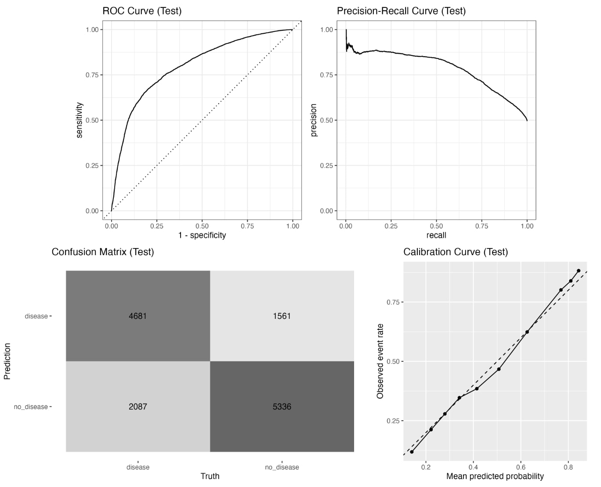
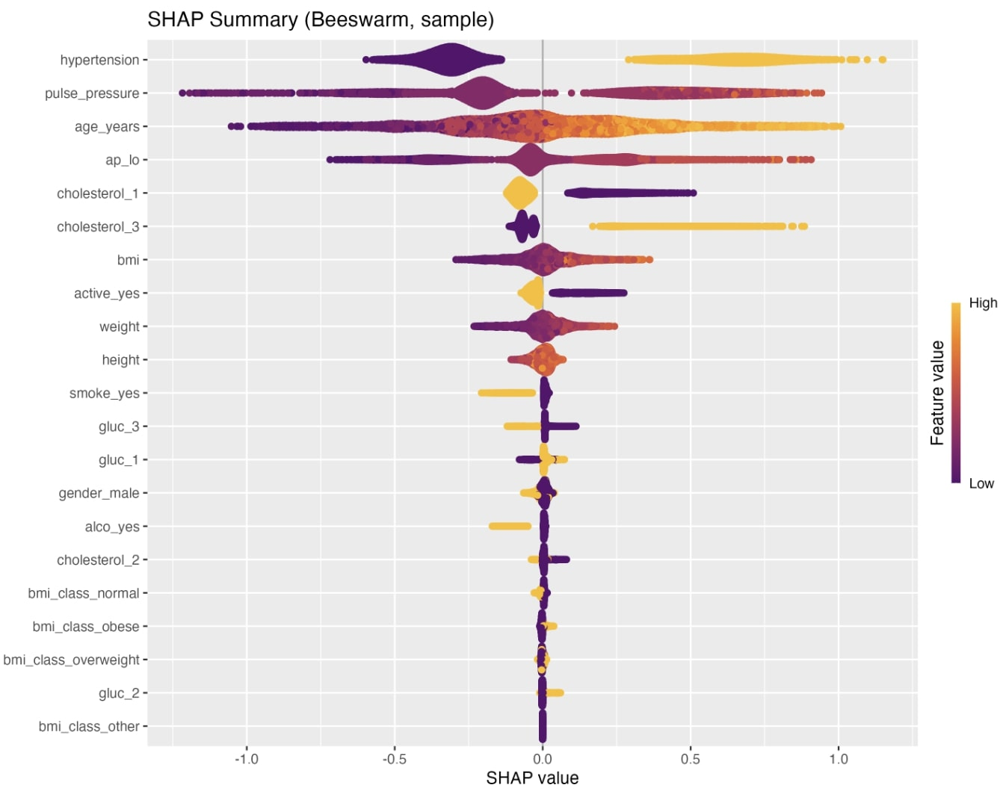

# group28: Cardiovascular Disease Prediction Model

## Overview

This R package contains a pre-trained XGBoost machine learning model for
predicting cardiovascular disease. It was developed as part of the
BIO215 Capstone Project.

## Installation

You can install the development version from GitHub with:

``` r
# install.packages("devtools")
devtools::install_github("Ruza0501/group28")
```

## Usage Example

Here is how to use the prediction function with sample data:

``` r
library(group28)

# 1. Create a dataframe with required biological features
# Note: Please pay attention to factor levels and types!
new_patient <- data.frame(
  age = 20000, 
  height = 165, 
  weight = 68, 
  ap_hi = 120, 
  ap_lo = 80,
  age_years = 54, 
  bmi = 24.9, 
  pulse_pressure = 40, 
  map = 93.3,
  hypertension = 0, # Must be integer (0 or 1)
  
  # Factors with specific levels
  gender = factor("male", levels = c("female", "male")),
  cholesterol = ordered("normal", levels = c("normal", "above_normal", "well_above_normal")),
  gluc = ordered("normal", levels = c("normal", "above_normal", "well_above_normal")),
  smoke = factor("no", levels = c("no", "yes")),
  alco = factor("no", levels = c("no", "yes")),
  active = factor("yes", levels = c("no", "yes")),
  bmi_class = factor("normal", levels = c("normal", "overweight", "obese", "other"))
)

# 2. Run prediction
result <- predict_group28(new_patient)
print(result)
```

## Model Performance

The XGBoost model implemented in this package was trained using a
stratified 5-fold cross-validation protocol. It demonstrates strong
predictive performance for cardiovascular disease.

### Key Metrics (Test Set)

- **ROC AUC:** 0.7986 (95% CI: 0.791 - 0.806)
- **Accuracy:** 73.3%
- **Sensitivity:** 69.2%
- **Specificity:** 77.4%

### Evaluation Plots

Below is the evaluation overview including ROC Curve, Precision-Recall
Curve, and Confusion Matrix:

<figure>

<figcaption aria-hidden="true">Model Performance</figcaption>
</figure>

### Feature Importance (Interpretation)

To understand the biological drivers of the prediction, we analyzed
feature importance using SHAP values. The top predictors include
**hypertension**, **pulse pressure**, and **age**, which aligns with
established medical knowledge.

<figure>

<figcaption aria-hidden="true">SHAP Summary</figcaption>
</figure>

## Shiny Web Application

As part of the BIO215 Capstone Project, we developed an interactive Shiny web application that serves as both a database explorer and a prediction tool for cardiovascular disease risk assessment. This application is deployed on ShinyApps.io and provides a user-friendly interface for both researchers and healthcare professionals.

### Application Features

#### 1. **Home Page** - Overview and Quick Statistics

The home page provides an overview of the cardiovascular disease dataset, including key statistics such as total patients, disease prevalence, average age, and number of features. Interactive visualizations show the distribution of disease status and age patterns.

#### 2. **Database Module** - Data Exploration and Visualization
- **Data Browser**: Browse, filter, and search patient records with interactive data tables
  
- **Visualizations**: Create custom plots including histograms, scatter plots, box plots, and density plots
  
- **Dataset Information**: View detailed variable descriptions and summary statistics
  

#### 3. **Prediction Module** - Machine Learning Risk Assessment
- **Batch Prediction**: Upload CSV files containing multiple patient records for automated risk assessment
  
- **Single Prediction**: Enter individual patient information manually for instant risk evaluation
  

#### 4. **About Page** - Project Information and Team Details

The about page provides comprehensive information about the BIO215 Capstone Project, including team member roles, project links, and important disclaimers.

### Key Features
- **Interactive Data Exploration**: Filter, sort, and visualize the cardiovascular disease dataset
- **Multiple Visualization Options**: Choose from various plot types with customizable parameters
- **Dual Prediction Modes**: Support for both batch file upload and single patient input
- **Risk Factor Analysis**: Detailed breakdown of contributing risk factors for individual predictions
- **Data Export**: Download filtered datasets, visualizations, and prediction results
- **User-Friendly Interface**: Intuitive navigation with clear instructions and feedback

### Live Deployment
The Shiny application is deployed on ShinyApps.io and can be accessed at:
[**https://yimengwang2363850.shinyapps.io/cardio_shiny_app/**]

### Technical Implementation
- **Framework**: R Shiny with responsive design using `shinythemes`
- **Data Handling**: Interactive tables with `DT`, data manipulation with `dplyr`
- **Visualization**: Advanced plotting with `ggplot2`
- **Machine Learning Integration**: Connects with the trained XGBoost model for predictions
- **Deployment**: Hosted on ShinyApps.io with automatic scaling and monitoring

### Usage Instructions
1. **For Data Exploration**: Navigate to the "Database" tab to browse, filter, and visualize the dataset
2. **For Risk Prediction**: Use the "Prediction" tab to either upload a CSV file or enter patient data manually
3. **For Results Export**: Download filtered data, plots, or prediction results using the download buttons

### Note for Researchers
This application is designed for educational and research purposes as part of the BIO215 Capstone Project. It should not be used for clinical diagnosis or medical decision-making. Always consult qualified healthcare professionals for medical advice.

---

**Project Team**:
- **Machine Learning Modeler**: Lingyu Jiang
- **Shiny Website Developer**: Yimeng Wang  
- **R Package Developer**: Zihao Wang

**BIO215 Capstone Project | Department of Bioinformatics**
